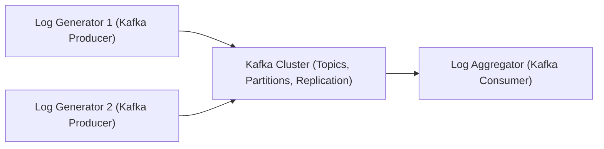

# Log Aggregation System

This project is a log aggregation system built with Apache Kafka and Java, and it runs with Docker. It simulates multiple applications generating logs, aggregates them in real time, and processes them for monitoring and analysis.

---

## 1. Objectives
  - **Practice Kafka & Docker Fundamentals:**  
    Gain hands-on experience with Kafka's producers, consumers, and Docker.
  - **Real-Time Data Processing:**  
    Process logs as they are produced, demonstrating real-time ingestion and processing.
  - **Scalability and Fault Tolerance:**  
    Leverage Kafka’s ability to handle high-throughput data and ensure the system is resilient.
  - **Extensible Architecture:**  
    Lay a foundation that can be extended later for features like filtering, alerting, or integration with dashboards.

---

## 2. Development Stage

### **Stage 1** (Completed)
- **Setup Development Environment:**  
  - Set up a Java project (using Maven or Gradle) with the necessary dependencies.
- **Simple Log Simulation:**  
  - Create one Java-based Kafka producer application that simulates log generation from different sources.
  - Define log formats and message schemas.
  - Develop a Java-based Kafka consumer that subscribes to the log topic.
- **Integration:**  
  - Connect producers and consumers to verify end-to-end data flow.
  - Ensure that the consumer correctly aggregates logs from multiple producers.

### **Stage 2** (Current)
- **Enhance Log Simulation:**  
  - Modify the producer to simulate logs from multiple sources or services.
  - Introduce different log levels (INFO, WARN, ERROR) or formats (e.g., JSON) to make the data more realistic.
- **Improve the Consumer:**  
  - Implement logic to aggregate or filter logs based on criteria such as log level, service name, or timestamp.
  - Consider writing the aggregated output to a file or a database for persistence and further analysis.
- **Add Robust Logging and Error Handling:**
  - Integrate a proper logging framework (e.g., slf4j with Logback).
  - Enhance error handling in both the producer and consumer to manage connection issues or message parsing failures.
- **Create tests for the producer and consumer logic:**
  - Use testing frameworks like JUnit to ensure your message processing behaves as expected.

### **Stage 3**
- **Explore Kafka Streams**
- **Build a Simple Dashboard**
---

## 3. System Architecture

### **High-Level Overview**

- **Components:**
  1. **Log Generators (Producers):**  
     Java applications that simulate log generation. Each producer sends log messages to a Kafka topic.
  2. **Apache Kafka Cluster:**  
     Acts as the backbone for messaging. It manages the distribution, replication, and partitioning of log messages.
  3. **Log Aggregator (Consumer):**  
     A Java-based application that subscribes to Kafka topics, consumes log messages, processes them (e.g., filtering or simple aggregation), and optionally stores or forwards them.
  4. **Optional Extensions:**  
     Future components might include a data storage system (e.g., a database), monitoring dashboards, or alerting mechanisms.

### **Data Flow and Communication**

1. **Log Generation:**  
   Log generators (Kafka producers) produce log messages that are published to one or more Kafka topics.
2. **Message Management:**  
   Apache Kafka manages the messages with built-in features like topic partitioning and replication, ensuring fault tolerance and high throughput.
3. **Log Aggregation:**  
   The Log Aggregator (Kafka consumer) subscribes to the Kafka topic(s) and processes the incoming logs in real time.
4. **Further Processing:**  
   Processed logs can be used for real-time monitoring, stored for historical analysis, or used to trigger alerts based on predefined rules.

### **Architecture Diagram**

- **Key Architectural Considerations:**
  - **Scalability:**  
    Kafka’s design ensures that as the volume of logs increases, the system can scale horizontally by adding more producers or consumers.
  - **Fault Tolerance:**  
    Kafka’s replication and partitioning features help ensure that the system remains resilient even if individual components fail.
  - **Extensibility:**  
    The design allows for easy integration with additional processing layers or external systems, making it a robust foundation for future enhancements.

---

This README serves as both the project design document and a roadmap to guide you through the implementation of the Log Aggregation System. Feel free to update or extend any sections as your project evolves.
