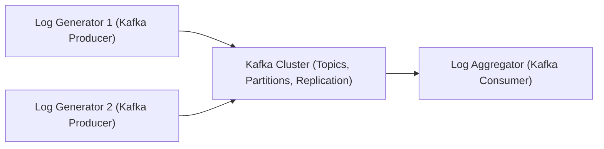

# Log Aggregation System

This project is a log aggregation system built with Apache Kafka and Java. It simulates multiple applications generating logs, aggregates them in real time, and processes these logs for monitoring and analysis.

---

## 1. Goals and Objectives

- **Primary Goal:**  
  Build a log aggregation system using Apache Kafka and Java that simulates multiple applications generating logs, aggregates them in real time, and processes the logs for monitoring and analysis.

- **Objectives:**
  - **Understand Kafka Fundamentals:**  
    Gain hands-on experience with Kafka's producers, consumers, and topic partitioning.
  - **Real-Time Data Processing:**  
    Process logs as they are produced, demonstrating real-time ingestion and processing.
  - **Scalability and Fault Tolerance:**  
    Leverage Kafka’s ability to handle high-throughput data and ensure the system is resilient.
  - **Extensible Architecture:**  
    Lay a foundation that can be extended later for features like filtering, alerting, or integration with dashboards.
  - **Solidify Java Integration:**  
    Utilize existing Java skills to develop both the producer (simulating log generation) and the consumer (log aggregator).

---

## 2. Timeline and Milestones

### **Day 1: Setup and Planning**
- **Setup Development Environment:**  
  - Install and configure Apache Kafka locally.
  - Set up a Java project (using Maven or Gradle) with the necessary dependencies.
  - Define project structure and commit an initial version to version control.
- **Milestone:**  
  Environment ready, basic project skeleton in place.

### **Day 2: Implement Kafka Producers**
- **Log Simulation:**  
  - Create one or more Java-based Kafka producer applications that simulate log generation from different sources.
  - Define log formats and message schemas.
- **Testing:**  
  - Send sample logs to a designated Kafka topic.
- **Milestone:**  
  Working Kafka producers that simulate multiple log sources.

### **Day 3: Implement Kafka Consumer (Log Aggregator)**
- **Consumer Development:**  
  - Develop a Java-based Kafka consumer that subscribes to the log topic.
  - Process incoming log messages (e.g., filtering, simple aggregation).
- **Error Handling & Logging:**  
  - Implement basic error handling and logging for the consumer application.
- **Milestone:**  
  Consumer processes and aggregates logs in real time.

### **Day 4: Integration and Testing**
- **Integration:**  
  - Connect producers and consumers to verify end-to-end data flow.
  - Ensure that the consumer correctly aggregates logs from multiple producers.
- **Unit and Integration Tests:**  
  - Write tests for critical components to validate functionality.
- **Milestone:**  
  The System is integrated with smooth data flow and basic tests in place.

### **Day 5: Enhancements and Finalization**
- **Optional Enhancements:**  
  - Implement additional features such as real-time dashboards or enhanced log filtering.
  - Optimize configurations for performance and reliability.
- **Documentation:**  
  - Finalize documentation and update the design doc with any changes.
- **Milestone:**  
  Project complete with enhancements and documentation finalized.

---

## 3. System Architecture

### **High-Level Overview**

- **Components:**
  1. **Log Generators (Producers):**  
     Java applications that simulate log generation. Each producer sends log messages to a Kafka topic.
  2. **Apache Kafka Cluster:**  
     Acts as the backbone for messaging. It manages the distribution, replication, and partitioning of log messages.
  3. **Log Aggregator (Consumer):**  
     A Java-based application that subscribes to Kafka topics, consumes log messages, processes them (e.g., filtering or simple aggregation), and optionally stores or forwards them.
  4. **Optional Extensions:**  
     Future components might include a data storage system (e.g., a database), monitoring dashboards, or alerting mechanisms.

### **Data Flow and Communication**

1. **Log Generation:**  
   Log generators (Kafka producers) produce log messages that are published to one or more Kafka topics.
2. **Message Management:**  
   Apache Kafka manages the messages with built-in features like topic partitioning and replication, ensuring fault tolerance and high throughput.
3. **Log Aggregation:**  
   The Log Aggregator (Kafka consumer) subscribes to the Kafka topic(s) and processes the incoming logs in real time.
4. **Further Processing:**  
   Processed logs can be used for real-time monitoring, stored for historical analysis, or used to trigger alerts based on predefined rules.

### **Architecture Diagram**

- **Key Architectural Considerations:**
  - **Scalability:**  
    Kafka’s design ensures that as the volume of logs increases, the system can scale horizontally by adding more producers or consumers.
  - **Fault Tolerance:**  
    Kafka’s replication and partitioning features help ensure that the system remains resilient even if individual components fail.
  - **Extensibility:**  
    The design allows for easy integration with additional processing layers or external systems, making it a robust foundation for future enhancements.

---

This README serves as both the project design document and a roadmap to guide you through the implementation of the Log Aggregation System. Feel free to update or extend any sections as your project evolves.
